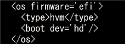
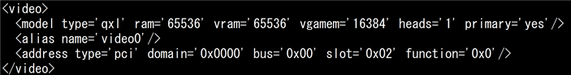
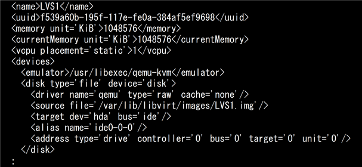
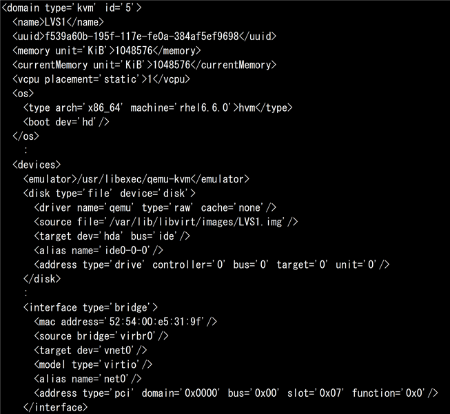
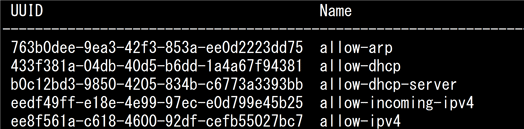
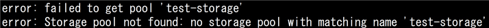

# Full Virtualization(主題351)

## 仮想化の概念と理論

| 問題 | 回答 | 復習１ |
| ---- | ---- | :----: |
| 以下の特徴を持つ仮想環境の統合管理プラットフォームソフトウェアは？ <br>・KVMとLXCをサポートしており、仮想マシンとコンテナの両方を一元的に管理できる <br>・仮想マシンのクラスタリング機能やストレージ管理、Webベースでの管理インタフェースを持つ | Proxmox VE | <span style="color: red; ">×</span> |
| 以下の特徴を持つ仮想環境の統合管理プラットフォームソフトウェアは？ <br>・VMware社が提供する仮想化環境の統合管理プラットフォーム <br>・VMwareの仮想化製品群を一元的に管理し、リソースの割り当て、パフォーマンスモニタリング、セキュリティ管理などの機能を提供 | VMware vCenter | <span style="color: red; ">×</span> |
| 以下の特徴を持つ仮想環境の統合管理プラットフォームソフトウェアは？ <br>・Citrix社が提供するXenServerの管理ツール <br>・XenServer環境の統合管理を行い、仮想マシンの作成、リソース割り当て、パフォーマンス監視などの機能を提供 | Citrix XenCenter | <span style="color: red; ">×</span> |
| KVMの仮想マシン管理ツールとしてRed Hatによって開発された仮想環境の統合管理プラットフォームで、次の特徴を持つソフトウェアは？ <br>・仮想マシン管理ツールのスタンダードとして簡易でわかりやすいWebインタフェース <br> ・複数のハイパーバイザーや仮想環境を包括的に管理できる | oVirt | ○ |
| 特定のハードウェアの動作をソフトウェアで模倣し、異なるシステム上で本来そのハードウェアでしか動作しないソフトウェアやOSを動かす技術は？ | エミュレーション | ○ |
| サーバ仮想化において、物理マシンのBIOSから直接起動した仮想化ソフトウェアで仮想マシンを動作させる手法をなんというか | ハイパーバイザー (型仮想化) | ○ |
| サーバ仮想化において、ホストOS上にインストールした仮想化ソフトウェアで仮想マシンを動作させる手法をなんというか | ホストOS (型仮想化) | ○ |
| 仮想ネットワークの構築、トラフィックの制御や管理を行うソフトウェアスイッチは？ | Open vSwitch | ○ |
| マルチプロセッサシステムのアーキテクチャにおいて、複数のCPUが1つの共有メモリを使用し、それぞれのCPUが共有メモリへ等しいアクセス時間でアクセスする方法は？（略語で） | SMP | ○ |
| マルチプロセッサシステムのアーキテクチャにおいて、複数のCPUがそれぞれ独自のメモリ（ローカルメモリ）を持つ方式は？（略語で） | NUMA | ○ |
| Intel製CPUにおける仮想化支援機能の名称は？ | Intel VT | <span style="color: red; ">×</span> |
| AMD製CPUにおける仮想化支援機能の名称は？ | AMD-V | <span style="color: red; ">×</span> |
| CPUの仮想化支援機能の一つで、ゲストOSの仮想メモリアドレスをホストの物理メモリアドレスに変換する機能は？（略称で。Intelが提供する技術の名称、AMDが提供する技術の名称の順に回答）| **Intel:** EPT <br> **AMD:** RVI | <span style="color: red; ">×</span> <br> <span style="color: red; ">×</span> |
| CPUに仮想化支援機能があるかどうかを確認できるファイルは？（フルパス） | /proc/cpuinfo | ○ |
| 「/proc/cpuinfo」において、Intel VTが有効になっている際のCPUフラグは？ | `vmx` | ○ |
| 「/proc/cpuinfo」において、AMD-Vが有効になっている際のCPUフラグは？ | `svm` | ○ |
| systemdにおいて、systemdのcgroup（control groups）を利用した仮想マシンやコンテナの基本的な管理のためのインタフェースを提供したり、CPU、メモリ、I/Oなどのリソース管理を行うコンポーネントは？ | systemd-machined | <span style="color: red; ">×</span> |

[戻る](../README.md#full-virtualization主題351)


## Xen 1

| 問題 | 回答 |
| ---- | ---- |
| Xenの高機能管理ツールであるAPIをなんというか | XAPI |
| Xenにおいて稼働中の仮想マシンの構成情報データベースをなんというか | XenStore |
| Xenの管理用ドメインをなんというか | Domain-0 |
| XenのゲストOSをインストールするドメインをなんというか | Domain-U |
| Domain-0側から見た際のDomain-Uの仮想ネットワークインターフェイス名をなんというか | vif |
| Xenにおいて、ドメイン（ゲスト）定義ファイルなどの主要なファイルやディレクトリが置かれるディレクトリは？ | /etc/xen/ |
| システム起動時に自動的にXenのゲストOSも起動させる場合、Xenのドメイン（ゲスト）定義ファイルのシンボリックリンクの配置先のディレクトリは？（フルパス）| /etc/xen/auto/ |
| Xenにおいてxlツールスタックの全体的な設定を行うファイルを答えよ（フルパス） | /etc/xen/xl.conf |
| Xenのドメイン定義ファイル「/etc/xen/xl.cfg（ドメイン名.cfg）」で、仮想CPUの数を指定する設定項目は？ | `vcpus` |
| Xenのドメイン定義ファイル「/etc/xen/xl.cfg（ドメイン名.cfg）」で、メモリサイズを指定する設定項目は？ | `memory` |
| Xenのドメイン定義ファイル「/etc/xen/xl.cfg（ドメイン名.cfg）」で、ドメインの仮想ネットワークインタフェースのMACアドレスとIPアドレスを指定する設定項目は？ | `vif` |
| Xenのドメイン定義ファイル「/etc/xen/xl.cfg（ドメイン名.cfg）」で、仮想マシンに割り当てるディスクデバイスを指定する設定項目は？ | `disk` |
| Xenのドメイン定義ファイル「/etc/xen/xl.cfg（ドメイン名.cfg）」で、RAMディスクファイルを絶対パスで指定する設定項目は？ | `ramdisk` |
| Xenのドメイン定義ファイル「/etc/xen/xl.cfg（ドメイン名.cfg）」で、カーネルイメージファイルを絶対パスで指定する設定項目は？ | `kernel` |
| Xenのドメイン定義ファイル「/etc/xen/xl.cfg（ドメイン名.cfg）」で、ルートデバイスを指定する設定項目は？ | `root` |
| Xenのドメイン定義ファイル「/etc/xen/xl.cfg（ドメイン名.cfg）」で、仮想マシン名を指定する設定項目は？ | `name` |
| Xenのドメイン定義ファイル「/etc/xen/xl.cfg（ドメイン名.cfg）」で、ドメインをハードディスクから起動するよう指定する設定項目および値は？ 設定項目、設定値の順に答えよ | **設定項目:** `boot` <br> **設定値:** `c` |
| Xenのドメイン定義ファイル「/etc/xen/xl.cfg（ドメイン名.cfg）」で、準仮想化マシンを作成するための設定項目および値は？設定項目、設定値の順に答えよ | **設定項目:** `builder` <br> **設定値:** `generic` |
| Xenのドメイン定義ファイル「/etc/xen/xl.cfg（ドメイン名.cfg）」で、マシンを作成するための設定項目および値は？設定項目、設定値の順に答えよ | **設定項目:** `builder` <br> **設定値:** `hvm` |
| Domain-0の起動オプションを記述するファイル名を答えよ（ファイル名のみ） | grub.cfg |
| 「grub.cfg」において、Domain-0のメモリ制限を設定する項目は？ | `dom0_mem` |
| Xenドメインの構成情報を階層的な名前空間で表示するコマンドは？ | `xenstore-ls` |
| Xenのコマンドで、各仮想マシンの稼働状況をリアルタイムに更新しながら表示するものは？（xlサブコマンド以外のコマンドを回答） | `xentop` |


[戻る](../README.md#full-virtualization主題351)


## Xen 2

| 問題 | 回答 |
| ---- | ---- |
| Xen 4.xでデフォルトで使用されるツールスタックは？ | xl |
| xlコマンドで、仮想マシンを起動するサブコマンドは？ | `create` |
| xlコマンドで、実行中の仮想マシンを停止するサブコマンドは？（強制終了、通常終了の順に回答） | **強制終了:** `destroy` <br> **通常終了:** `shutdown` |
| xlコマンドで、仮想マシンを再起動するサブコマンドは？ | `reboot` |
| xlコマンドで、仮想マシンのコンソールに接続するサブコマンドは？ | `console` |
| xlコマンドで、仮想マシンを一時停止するサブコマンドは？ | `pause` |
| xlコマンドで、一時停止中の仮想マシンを再開するサブコマンドは？ | `unpause` |
| xlコマンドで、仮想マシンの状態をファイルに保存・停止するサブコマンドは？ | `save` |
| xlコマンドで、仮想マシンを状態ファイルから復元・起動するサブコマンドは？ | `restore` |
| xlコマンドで、稼働中の仮想マシンの一覧を表示するサブコマンドは？ | `list` |
| xlコマンドで、稼働中の仮想マシンの情報をリアルタイムに更新しながら表示するサブコマンドは？ | `top` | 
| xlコマンドで、仮想マシンの仮想CPUの情報を表示するサブコマンドは？ | `vcpu-list` |
| xlコマンドで、仮想マシンの仮想CPU数を設定するサブコマンドは？ | `vcpu-set` |
| xlコマンドで、仮想マシンのブロックデバイス一覧を表示するサブコマンドは？ | `block-list` |
| xlコマンドで、準仮想化ゲストの仮想CD-ROMを入れ替えるサブコマンドは？仮想CD-ROMの排出、挿入の順に答えよ  | **排出:** `block-detach` <br> **挿入:** `block-attach` |
| xlコマンドで、完全仮想化ゲストの仮想CD-ROMを入れ替えるサブコマンドは？ただし、ホストから見たブロックデバイスの変更ができるだけ少ないコマンドとする。仮想CD-ROMの排出、挿入の順に答えよ | **排出:** `cd-eject` <br> **挿入:** `cd-insert` |
| xlコマンドで、Xen起動時のメッセージを表示するサブコマンドは？ | `dmesg` |
| Xenの「Fedora」というドメインを移行先のホスト192.168.1.30へ稼働中のまま移行したい。下線部に当てはまるサブコマンドは？ <br> ```xl ___________ Fedora 192.168.1.30``` | `migrate` |
| 「/etc/xen/centos」ファイルに従って仮想マシンを起動し、コンソールに接続したい。下線部に当てはまるオプションは？ <br> ```xl create ____ /etc/xen/centos``` | `-c` |
| Xenがインストールされている環境で、使用マシンのIntel CPUが完全仮想化に対応しているかを確認したい。以下のコマンド文を完成させよ <br> ```xl dmesg \| grep ______``` | `HVM` |

[戻る](../README.md#full-virtualization主題351)


## QEMU 1

| 問題 | 回答 |
| ---- | ---- |
| QEMUが、ブロックデバイスやネットワークインタフェースなどの仮想化を実現したり、ホストOSのデバイスと通信する機能を持つデバイスドライバの標準をなんというか | VirtIO |
| QEMUにおいて、仮想ブリッジ「br1」を作成して使用したい。下線に当てはまるコマンドを答えよ。<br> ```______ addbr br1``` <br> ```ip link add br1 type _______``` | `brctl` <br> `bridge` |
| QEMUにおいて、TAPインタフェース「tap0」を作成して使用したい。下線に当てはまるコマンドを答えよ。 <br> ```______ -p -t tap0``` <br> ```ip ______ add dev tap0 mode tap``` | `tunctl` <br> `tuntap` |
| KVMの仮想環境において、QEMUがKVMとやりとりをするデバイスファイル名は？（フルパス） | /dev/kvm |
| Intel VT対応のCPUを使用している環境下でKVMを使用するためのカーネルモジュールのファイル名は？| kvm_intel.ko |
| AMD-V対応のCPUを使用している環境下でKVMを使用するためのカーネルモジュールのファイル名は？ | kvm_amd.ko |
| QEMUモニタで、稼働中の仮想マシンのスナップショットを作成するコマンドは？ | `savevm` |
| QEMUモニタで、スナップショットから復元を行うコマンドは？ | `loadvm` |
| QEMUモニタで、スナップショットを削除するコマンドは？ | `delvm` |
| QEMUモニタで、仮想マシンに挿入されているCD-ROMを排出するコマンドは？ | `eject` |
| QEMUモニタで、仮想マシンのCPU情報を確認するコマンドは？ | ```info cpus``` |
| QEMUモニタで、稼働中の仮想マシンのネットワーク情報を確認するコマンドは？ | ```info network``` |
| QEMUモニタで、稼働中の仮想マシンのブロックデバイス情報を確認するコマンドは？ | `info block` |
| QEMUモニタで、仮想マシンのスナップショット一覧を表示するコマンドは？| ```info snapshots``` |
| QEMUモニタで、KVMが有効か無効かを確認するコマンドは？ | ```info kvm``` |
| QEMUモニタで、「 ```qemu-system-x86_64 -cdrom``` 」により取り付けられた仮想CD-ROMドライブから仮想メディアを強制的に取り出すコマンドは？ | ```eject -f ide1-cd0``` |
| QEMUモニタで、仮想マシンのCD-ROMを「centos.iso」に入れ替えるコマンドは？ | ```change ide1-cd0 centos.iso``` |

[戻る](../README.md#full-virtualization主題351)


## QEMU 2

| 問題 | 回答 |
| ---- | ---- |
| QEMUでゲストOSのインストールや起動・設定など各種操作を行うコマンドユーティリティは？なお、アーキテクチャはx86_64向けのものとする | `qemu-system-x86_64` |
| qemu（qemu-system-x86_64）コマンドで、仮想マシンに対して指定した数のCPUを持つSMPシステムとしてエミュレートするオプションは？ | `-smp` |
| qemu（qemu-system-x86_64）コマンドで、仮想マシンのメモリサイズを指定するオプションは？ | `-m` |
| qemu（qemu-system-x86_64）コマンドで、ユーザーモードネットワークを使用するよう指定するオプションは？ | `-net user` |
| qemu（qemu-system-x86_64）コマンドで、VLANに接続するNICを作成するオプションは？ | `-net nic` |
| qemu（qemu-system-x86_64）コマンドで、TUN/TAPデバイスを使用してゲストOSとホストOSを仮想ネットワークで接続するオプションは？ | `-net tap` |
| qemu（qemu-system-x86_64）コマンドで、仮想ディスクイメージファイルを最初のハードディスクとして指定するオプションは？ | `-hda` |
| qemu（qemu-system-x86_64）コマンドで、ISOイメージを仮想マシンにCD-ROMとして指定するオプションは？ | `-cdrom` |
| qemu（qemu-system-x86_64）コマンドで、ブートデバイスを指定するオプションは？ | `-boot` |
| qemu（qemu-system-x86_64）コマンドで、Linuxを直接起動する際にLinuxカーネルのパラメータを指定するオプションは？ | `-append` |
| qemu（qemu-system-x86_64）コマンドで、ハードウェア拡張機能を有効化するオプションは？ | `-accel` |
| qemu（qemu-system-x86_64）コマンドで、仮想USBマウスをエミュレートするオプションは？  | `-usbdevice mouse` |
| qemu（qemu-system-x86_64）コマンドで、VNCを画面出力として使用する場合にマウスポインタの絶対位置を特定するオプションは？ | `-usbdevice tablet` |
| qemu（qemu-system-x86_64）コマンドで、QEMUモニタに標準入出力を使うよう指定するオプションは？ | `-monitor stdio` | 
| qemu（qemu-system-x86_64）コマンドで、仮想マシン名を指定するオプションは？ | `-name` |
| qemu（qemu-system-x86_64）コマンドで、指定したファイルから仮想マシンの設定を読み込むオプションは？ | `-readconfig` |
| qemu（qemu-system-x86_64）コマンドで、仮想マシンの設定をファイルに出力するオプションは？| `-writeconfig` | 
| qemu（qemu-system-x86_64）コマンドで、以下と同じ意味を持つオプションの指定は？ <br> ```-drive file=vm1.img,if=ide,index=0,media=disk``` | `-hda vm1.img` |
| qemu（qemu-system-x86_64）コマンドで、カーネルを指定して直接仮想マシンを起動する場合に指定するオプションは？カーネルイメージ、初期RAMディスク、ルートファイルシステム の順に答えよ <br> ```qemu-system-x86_64 -hda vm1.img \``` <br> ```　　　______ /boot/bzImage \``` <br> ```　　　______ /boot/initramfs.img \``` <br> ```　　　______ "root=/dev/hda"``` <br> | `-kernel` <br> `-initrd` <br> `-append` |

[戻る](../README.md#full-virtualization主題351)


## Libvirt Virtual Machine Management 1

| 問題 | 回答 |
| ---- | ---- |
| Xen、KVMなど、仮想化ソフトウェアに対応する統合管理基盤をなんというか | libvirt |
| 仮想化の統合管理基盤であるlibvirtのデーモンは？ | libvirtd |
| libvirtにおいて、仮想マシンのログ処理を担い、仮想マシンからのログ出力を受け取り、処理・保存等を行うデーモンは？ | virtlogd |
| libvirtにおいて、仮想マシンリソースのロック管理を担当し、複数の仮想マシンが同じリソースに同時にアクセスすることを防ぐデーモンは？ | virtlockd |
| libvirtにおいて、CUIで仮想マシンを作成し、ゲストOSをインストールするツールは？ | virt-install |
| libvirtにおいて、GUIで仮想マシンを作成・管理するツールは？ | virt-manager |
| libvirtにおいて、仮想マシンのクローンを作成するツールは？ | virt-clone |
| libvirtにおいて、ゲストOSのグラフィカルコンソールを表示するツールは？ | virt-viewer |
| libvirtにおいて、仮想マシンの定義ファイルやネットワークなどの設定ファイルが配置されているディレクトリは？  | /etc/libvirt/ |
| libvirtにおける仮想マシンの設定ファイルの保存形式は？（略語で） | XML (形式) |

[戻る](../README.md#full-virtualization主題351)


## Libvirt Virtual Machine Management 2

| 問題 | 回答 |
| ---- | ---- |
| virshコマンドにおいて、XML形式のファイルから仮想マシンを作成し、新規の仮想マシンを起動するサブコマンドは？ | `create` |
| virshコマンドにおいて、仮想マシンを起動するサブコマンドは？ | `start` |
| virshコマンドにおいて、仮想マシンを終了するサブコマンドは？ | `shutdown` |
| virshコマンドにおいて、仮想マシンを強制終了するサブコマンドは？ | `destroy` |
| virshコマンドにおいて、仮想マシンを再起動するサブコマンドは？ | `reboot` |
| virshコマンドにおいて、仮想マシンのコンソールに接続するサブコマンドは？ | `console` |
| virshコマンドにおいて、仮想マシンを一時停止するサブコマンドは？ | `suspend` |
| virshコマンドにおいて、一時停止中の仮想マシンを再開するサブコマンドは？ | `resume` |
| virshコマンドにおいて、仮想マシンの状態をファイルに保存し、停止するサブコマンドは？ | `save` |
| virshコマンドにおいて、保存したファイルから仮想マシンを復元し、起動するサブコマンドは？ | `restore` |
| virshコマンドにおいて、ドメイン情報を出力するサブコマンドは？ | `dominfo` |
| virshコマンドにおいて、稼働中の仮想マシンの一覧を表示するサブコマンドは？ | `list` |
| virshコマンドにおいて、仮想マシンのダンプをファイルに出力するサブコマンドは？ | `dump` |
| virshコマンドにおいて、仮想マシンの仮想CPUの情報を表示するサブコマンドは？ | `vcpuinfo` |
| virshコマンドにおいて、仮想マシンの仮想CPUと物理CPUの割り当てを固定化（仮想CPUのアフィニティの制御）するサブコマンドは？ | `vcpupin` |
| virshコマンドにおいて、仮想マシンの仮想CPUの数を設定するサブコマンドは？ | `setvcpus` |
| virshコマンドにおいて、仮想マシンのメモリサイズを指定するサブコマンドは？ | `setmem` |
| virshコマンドにおいて、仮想CD-ROMを交換するサブコマンドは？ | `change-media` |
| virshコマンドにおいて、仮想マシンを別のホストに移行するサブコマンドは？ | `migrate` |
| virshコマンドにおいて、物理マシン起動時にゲストOSを自動起動するように設定するサブコマンドは？ | `autostart` |
| virshコマンドにおいて、XML形式の仮想マシン定義を標準出力に出力するサブコマンドは？ | `dumpxml` |
| virshコマンドにおいて、XML形式で記述された仮想マシンの設定を書き換えるサブコマンドは？ | `edit` |
| virshコマンドにおいて、QEMUモニタのコマンドを実行するサブコマンドは？ | `qemu-monitor-command` |
| 以下の意味のコマンドを完成させよ。<br> ドメイン「 `HOGE` 」の仮想CPU2番を、物理CPUの0,1,2番と5番に関連付ける <br> ```virsh vcpupin HOGE ______ ______``` <br> ※物理CPUの指定は「 `-` （ハイフン）」を用いること | `2` <br> `0-2,5` |

[戻る](../README.md#full-virtualization主題351)


## Libvirt Virtual Machine Management 3


| 問題 | 回答 |
| ---- | ---- |
| 以下はvirsh dumpxmlの出力である。ドメイン `Fedora` のハイパーバイザーを答えよ。 <br>   | KVM |
| 以下はvirsh dumpxmlの出力である。 `os` エレメントにおいて、仮想マシンのブート時に使用するファームウェアをBIOSにしたいとき、設定する項目名はどれか。項目名のみ答えよ  <br>   | `firmware` |
| 以下はvirsh dumpxmlの出力である。virsh editコマンドを用いて、仮想マシンのビデオカードに「 `vga` 」を指定したい。以下の設定のうち書き換える必要がある箇所を、正しく変更して答えよ。 <br>  | `model type='vga'` |
| 以下はvirsh editコマンドの出力である。仮想マシンの割当てメモリ量を変更したいときの項目名を答えよ <br>  | `memory unit` |
| virsh editコマンドを用いて、仮想マシンのネットワークデバイスを「 `e1000` 」ドライバを用いるように変更したい。以下の設定のうち書き換える必要がある箇所を、正しく変更して答えよ。<br>  | `model type='e1000'` |
| virshコマンドにおいて、仮想ネットワークを起動するサブコマンドは？ | `net-start` |
| virshコマンドにおいて、仮想ネットワークの強制停止を行うサブコマンドは？ | `net-destroy` |
| virshコマンドにおいて、仮想ネットワークをリスト表示するサブコマンドは？ | `net-list` |
| virshコマンドにおいて、XML形式の設定ファイルを開いて仮想ネットワークの設定変更を行うサブコマンドは？ | `net-edit` |
| virshコマンドにおいて、仮想ネットワークの自動起動を設定するサブコマンドは？ | `net-autostart` |
| virshコマンドにおいて、ネットワークフィルタリングのルールを定義するサブコマンドと定義を削除するサブコマンドをそれぞれ答えよ | `nwfilter-define` <br> `nwfilter-undefine` |
| virshコマンドにおいて、以下の出力を得るサブコマンドは？ <br>  | `nwfilter-list` |
| virshコマンドを用いてネットワークフィルタリングのルール「 `sample-filter` 」の内容をXML形式で表示したいとき、下線部にあてはまるサブコマンドを答えよ <br> ```virsh ____________ sample-filter``` | `nwfilter-dumpxml` |
| virshコマンドを用いてネットワークフィルタリングのルール「 `sample-filter` 」をXML形式で編集するとき、下線部にあてはまるサブコマンドを答えよ <br> ```virsh ____________ sample-filter``` | `nwfilter-edit` |
| virshコマンドで、ストレージプール「 `default` 」のボリュームの詳細なリストを表示したい。下線部に当てはまるものを答えよ。 <br> ```virsh _______ default _________``` | `vol-list` <br> `--details` |
| virshコマンドにおいて、一時的なストレージプールを作成するサブコマンドは？ | `pool-create-as` |
| virshコマンドにおいて、永続的なストレージプールを作成するサブコマンドは？ | `pool-define-as` |
| virshコマンドにおいて、ストレージプールの一覧を表示するサブコマンドは？ | `pool-list` |
| 「 ```virsh vol-list test-storage``` 」コマンドを実行すると、以下のエラーが表示された。エラーを解消するために、「 `/test` 」ディレクトリにストレージプールを作成したい。ストレージタイプをディレクトリとするとき、下線部に当てはまるものを答えよ <br> ```virsh pool-create-as test-storage ______ --target ______``` <br>  | `dir` <br> `/test` |
| virshコマンドにおいて、スナップショットを作成するサブコマンドは？ | `snapshot-create-as` |
| virshコマンドにおいて、スナップショットの一覧を表示するサブコマンドは？ | `snapshot-list` |
| virshコマンドを用いて仮想マシン「 `fedora` 」のスナップショット「 `snap01` 」を削除するとき、下線部に当てはまるサブコマンドは？ <br> ```virsh _________ fedora snap01``` | `snapshot-delete` |
| virshコマンドを用いて仮想マシン「 `fedora` 」を、スナップショット「 `snap01` 」の状態に復元するとき、下線部に当てはまるサブコマンドは？ <br> ```virsh _________ fedora snap01``` | `snapshot-revert` |

[戻る](../README.md#full-virtualization主題351)


## 仮想マシンのディスクイメージの管理

| 問題 | 回答 |
| ---- | ---- |
| qemu-imgコマンドにおいて、仮想マシン用のディスクイメージを作成するサブコマンドは？ | `create` |
| qemu-imgコマンドにおいて、仮想ディスクイメージのファイル形式を変換するサブコマンドは？  | `convert` |
| qemu-imgコマンドにおいて、仮想ディスクイメージファイルのサイズを変更するサブコマンドは？ | `resize` |
| qemu-imgコマンドにおいて、仮想ディスクイメージファイルの情報を表示するサブコマンドは？ | `info` |
| 以下の条件で仮想ディスクイメージを作成するとき、下線部に当てはまるものを答えよ <br>・ファイル形式：qcow2 <br>・ファイル名：centos.img <br>・サイズ：8GB <br> ```qemu-img create ____ qcow2 centos.img 8G``` | `-f` |
| qemu-imgコマンドを用いて、仮想マシンのスナップショット一覧を表示するコマンドラインを答えよ | ```qemu-img snapshot -l``` |
| 仮想マシンのディスクイメージを、ホストシステムへマウントして操作することができるオープンソースのライブラリ名は？| libguestfs |
| libguestfsライブラリを用いて、仮想マシンのディスクイメージ上のファイルへアクセスしたり編集することができるツールは？ | guestfish |
| libguestfsのツールで、仮想マシンのディスクイメージをマウントするコマンドとアンマウントするコマンドをそれぞれ答えよ| **マウント:** `guestmount` <br>**アンマウント:** `guestunmount` |
| libguestfsのツールで、仮想マシンのディスクイメージ内のファイルを編集するコマンドは？ | `virt-edit` |
| libguestfsのツールで、仮想マシンのディスクイメージ内のファイルの内容を表示するコマンドは？ | `virt-cat` |
| libguestfsのツールで、仮想マシンのディスクイメージ内のファイルシステムとパーティションを表示するコマンドは？ | `virt-filesystems` |
| libguestfsのツールで、仮想マシンのディスクイメージにインストールされたOSやアプリケーション等の情報を取得するコマンドは？ | `virt-inspector` |
| libguestfsのツールで、仮想マシンのディスクイメージ上にある「/home/guest」ディレクトリを、ホストマシンのディレクトリへコピーしたいとき、用いるコマンドは？ | `virt-copy-out` |
| libguestfsのツールで、ホストマシンからディスクイメージへファイルやディレクトリをコピーするコマンドは？| `virt-copy-in` |
| libguestfsのツールで、仮想マシンのディスクイメージの容量を変更するコマンドは？ | `virt-resize` |
| libguestfsのツールで、仮想マシンのディスクイメージから機密情報を削除するコマンドは？ | `virt-sysprep` |
| libguestfsのツールで、ディスクイメージの未使用領域を削除（圧縮）し、別のファイルとして出力するコマンドは？ | `virt-sparsify` |
| libguestfsのツールで、ゲストOSが起動しないときに救助用のシェルを提供するコマンドは？ | `virt-rescue` |
| libguestfsのツールで、VMwareやXenなどのハイパーバイザー上で動作する仮想マシンを、KVM、RHEV、またはoVirt互換の環境で動作可能な形式に変換するコマンドは？ | `virt-v2v` |
| libguestfsのツールで、物理マシンを仮想マシンのディスクイメージへ変換するコマンドは？| `virt-p2v` |
| libguestfsのツールで、物理マシンを仮想マシンに変換するためのブータブルディスクまたはUSBイメージを作成するコマンドは？ | `virt-p2v-make-disk` |
| libguestfsのツールで、2つのディスクイメージ「old.qcow2」と「new.qcow2」の差分を表示するコマンドは？ 下線部を答えよ ```_________ -a old.qcow2 -A new.qcow2``` | `virt-diff` |
| libguestfsのツールで、仮想マシンのディスクイメージ「img.qcow2」のファイルシステム「/dev/hoge/root」を、ホストマシンの「/mnt」へマウントしたいとき、下線部に当てはまるものを答えよ <br> ```guestmount -a ________ -m ______ ________``` | `img.qcow2` <br> `/dev/hoge/root` <br> `/mnt` |
| libguestfsのツールを用いて、仮想マシン「hoge」のディスク使用量を参照するコマンドを答えよ | ```virt-df -d hoge``` |
| libguestfsのツールを用いて、仮想マシンのディスクイメージ「hoge.img」のディスク使用量を参照するコマンドを答えよ | ```virt-df -a hoge.img``` |
| 仮想マシン「demo」をテスト環境用のテンプレートとして使用するため仮想マシンに保存されたユーザアカウントやSSHのキーなどの情報を削除したい。適切なコマンドラインを答えよ | ```virt-sysprep -d demo``` |
| 仮想マシンのディスクイメージのファイル形式で、以下の特徴を持つものは？（略語で） <br>・QEMUがサポートする形式である <br>・ファイル内にメタデータを持ち、スナップショットを取得できる  | qcow2 |
| 仮想マシンのディスクイメージのファイル形式で、以下の特徴を持つものは？（略語で） <br>・QEMUがサポートする形式である・単純なデータ列で構成され、実体はスパースファイル <br>・スナップショットの取得に対応していない | raw |
| 仮想マシンのディスクイメージのファイル形式で、VMwareによって開発され、VMware製品で広く使用されるものは？（略語で） | VMDK |
| 仮想マシンのディスクイメージのファイル形式で、Microsoftによって開発され、主にHyper-VやVirtual PCで使用されるものは？（略語で） | VHD |
| 仮想マシンのディスクイメージのファイル形式で、仮想マシンを異なるハイパーバイザー間で移行したり、仮想マシンを配布するために使用されるものは？（略語で） | OVF |

[戻る](../README.md#full-virtualization主題351)
