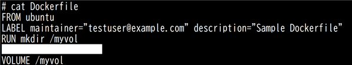

# コンテナ仮想化(主題352)

## コンテナ仮想化の概念

| 問題 | 回答 |
| ---- | ---- |
| 名前空間（NameSpace）機能の操作において、新しい名前空間を作成し、作成した名前空間内でコマンドを実行するコマンドは？ | `unshare` |
| コンテナ型仮想化において、タスク（プロセスやスレッド）に対してリソース制限を適用し、コンテナ内のタスクが他のタスクやホストシステムに影響を与えないようにするLinuxカーネルの機能は？（英語2語で） | Control Group |
| コンテナイメージの検査や署名、コピーや転送などを行うコンテナ管理ツールは？ | Skopeo |
| プロセスIDが22222で動作しているコンテナのケーパビリティを確認できるファイルは？（フルパス） | /proc/22222/status |
| コンテナ型仮想化において、プロセスに独自の分離された環境を提供することで、コンテナの独立した実行環境を実現するLinuxカーネルの機能は？（英語で） | NameSpace |
| ネットワーク名前空間「net-test」を作成したい。下線部に当てはまるコマンドを答えよ <br> ```ip _________ add net-test``` | `netns` |
| それぞれの説明にあうcgroupのコントローラ（サブシステム）を答えよ <br>・デバイスへのアクセス制御 <br>・プロセスの一時停止または再開 <br>・ネットワークトラフィックの優先度を設定 <br>・cgroupから発信されるパケットをタグ付けして制御 | `devices` <br> `freezer` <br> `net_prio` <br> `net_cls` |
| FreeBSDにおいて、プロセスやリソースをJailと呼ばれる区画に分けてホストから独立した環境を提供する仮想化技術は？ | FreeBSD jail |
| cgroupにおいて、特定のcgroupに所属するプロセスが列挙されており、cgroupにプロセスを所属させる場合にはPIDを追加するファイルは？（ファイル名のみ） | cgroup.procs |
| それぞれの説明にあうcgroupのコントローラ（サブシステム）を答えよ <br>・ブロックデバイスに対するI/Oへのアクセス制御および監視 <br> ・CPUおよびメモリノードの割り当て | `blkio` <br> `cpuset` |
| 名前空間（NameSpace）機能の操作において、特定のプロセスが属する名前空間にプロセスを参加させるコマンドは？ | `nsenter` |
| systemdにおいて、完全なLinuxシステム環境をコンテナ化することができ、コンテナ内でsystemdのcgroup機能を利用してリソース制御を行うシステムコンテナ技術は？ | systemd-nspawn |
| OCIが提供するコンテナイメージの標準規格は？（略語で） | image-spec |
| 旧CoreOS社が開発したコンテナランタイムは？（略語で） | rkt |
| それぞれの説明にあうcgroupのコントローラ（サブシステム）を答えよ <br> ・CPUアクセスのスケジューリング <br>・メモリリソースのレポートの作成やメモリ使用量の上限設定 | `cpu` <br> `memory` |
| コンテナ型仮想化において、プロセスに与えられる特権的な操作の細分化された単位であり必要最小限の特権でコンテナのプロセスを実行するLinuxカーネルの機能は？（英語で） | Capabilities |
| cgroupfsがデフォルトでマウントされるディレクトリは？（フルパス） | /sys/fs/cgroup/ | 
| DockerやKubernetesとの互換性があり、コンテナイメージを構築（ビルド）する際に利用されるコンテナ管理ツールは？ | Buildah | 
| ケーパビリティの操作において、プロセスのケーパビリティについて表示したり、ケーパビリティの設定や変更を行うことができるコマンドは？ | capsh |
| プロセスIDが22222で動作しているコンテナが属している名前空間を確認できるコマンドは？コマンド名が短い方から順に答えよ | ```ls -l /proc/22222/ns``` ```lsns -p 22222``` |
| 以下に該当する、コンテナ仮想化のセキュリティ強化に用いられているLinuxの機能は？（略語で） <br>・コンテナ内のプロセスがアクセスできるファイル、ディレクトリ、ネットワークリソースへの不正なアクセスを防ぐ <br> ・主にDebian系ディストリビューションで採用されている | AppArmor |
| 以下に該当する、コンテナ仮想化のセキュリティ強化に用いられているLinuxの機能は？（略語で） <br>・強制アクセス制御（MAC）を提供する <br>・コンテナ内のプロセスがホストシステムや他のコンテナのリソースへの不正なアクセスを防ぐ <br>  ・主にRed Hat系ディストリビューションで採用されている | SELinux |
| 以下に該当する、コンテナ仮想化のセキュリティ強化に用いられているLinuxの機能は？（略語で） <br>・プロセスが実行できるシステムコールを制限する <br>・コンテナ内のプロセスに対して、必要最小限のシステムコールのみを許可することで、攻撃対象を減らすことができる | seccomp |

[戻る](../README.md#コンテナ仮想化主題352)


## LXC

| 問題 | 回答 |
| ---- | ---- |
| LinuxContainers.orgによって開発され、Linuxカーネルの名前空間を利用して実現されるコンテナ型の仮想化ソフトウェアは？（略語で） | LXC |
| LXCコンテナ「hoge」のログファイル名は？（フルパス） | /var/log/lxc/hoge.log |
| LXCにおいて、コンテナ作成時に各コンテナのデフォルトの設定として反映されるファイル名を答えよ（フルパス） | /etc/lxc/default.conf |
| LXCコンテナの設定やrootファイルシステムなどが保存されているディレクトリは？（フルパス） | /var/lib/lxc/ |
| LXCにおいて、コンテナを作成するコマンドは？ | `lxc-create` |
| LXCにおいて、コンテナを起動するコマンドは？ | `lxc-start` |
| LXCにおいて、コンテナを停止するコマンドは？ | `lxc-stop` |
| LXCにおいて、コンテナを廃棄するコマンドは？ | `lxc-destroy` |
| LXCにおいて、コンテナにログインすることなく指定したコマンドを実行するコマンドは？ | `lxc-attach` |
| LXCにおいて、コンテナにコンソール接続するコマンドは？ | `lxc-console` |
| LXCにおいて、コンテナ内で動作しているプロセスを一時的に停止し、新たなプロセスを動作させないようにするコマンドは？ | `lxc-freeze` |
| LXCにおいて、一時停止していたコンテナを再稼働するコマンドは？ | `lxc-unfreeze` |
| LXCにおいて、コンテナの一覧を表示するコマンドは？ | `lxc-ls` |
| LXCにおいて、各コンテナを指定してコンテナ情報を表示するコマンドは？ | `lxc-info` |
| LXCにおいて、LXCコンテナのリソースの情報を表示したり設定することができるコマンドは？ | `lxc-cgroup` |
| LXCにおいて、LXCコンテナの稼働状況を、メモリの使用状況やCPU使用率、ディスクI/Oなどの条件でソートして出力するコマンドは？ | `lxc-top` |
| LXCにおいて、LXCコンテナの状態を保存したり、保存したコンテナをリストアするコマンドは？ | `lxc-checkpoint` |
| LXCにおいて、コンテナ「con」でシェルを起動するコマンドを答えよ | ```lxc-attach -n con``` |
| LXCを基盤に、より高度なコンテナ管理システムとして作成されたソフトウェアは？（略語で） | LXD |
| LXDにおいて、LXDが作成する仮想ブリッジ「lxdbr0」を経由して、ホストとコンテナ間およびコンテナ同士の通信が可能なネットワークタイプは？ | bridged |
| LXDにおいて、コンテナに独自のMACアドレスを持たせ、物理NICを仮想的に分割することで物理ネットワークへの直接的な接続が可能なネットワークタイプは？ | macvlan |
| LXDにおいて、ホストの物理NICをコンテナに割り当てるネットワークタイプは？ | physical |

[戻る](../README.md#コンテナ仮想化主題352)


## Docker 1

| 問題 | 回答 |
| ---- | ---- |
| dockerコマンドにおいて、起動中のコンテナへログインするサブコマンドは？ | `attach` |
| docker create、docker runコマンドにおいて、既に存在するコンテナのボリューム構成を再利用するオプションは？ | `--volumes-from` |
| Dockerのコンテナごとの設定やイメージ、ログなどが配置されたディレクトリは？（フルパス） | /var/lib/docker/ |
| Dockerのデーモンdockerdのオプションをカスタマイズするファイルは？（フルパス） | /etc/docker/daemon.json |

[戻る](../README.md#コンテナ仮想化主題352)


## Docker 2

| 問題 | 回答 |
| ---- | ---- |
| Dockerfileにおいて、作業ディレクトリを指定する命令は？ | `WORKDIR` |
| Dockerfileにおいて、作成者やバージョン情報などのメタデータを指定する命令は？ | `LABEL` |
| Dockerfileにおいて、作成するマウントポイントを指定する命令は？ | `VOLUME` |
| 以下のDockerfileで、コンテナ起動時に「Hello, Docker」と出力させたい。CMDコマンドによる命令を、シェル形式とexec形式で答えよ。 <br> | **シェル形式：** `CMD echo "Hello, Docker"` <br> **exec形式：** `CMD [ "echo", "Hello, Docker" ]` |
| 以下のDockerfileで、コンテナ起動時に「Hello, Docker」と出力させたい。ENTRYPOINTコマンドによる命令を、シェル形式とexec形式で答えよ。 <br> | **シェル形式：** `ENTRYPOINT echo "Hello, Docker"` <br> **exec形式：** `ENTRYPOINT [ "echo", "Hello, Docker" ]` |

[戻る](../README.md#コンテナ仮想化主題352)


## コンテナオーケストレーションプラットフォーム

| 問題 | 回答 |
| ---- | ---- |
| 次の特徴を持つコンテナオーケストレーションプラットフォームは？ <br> ・「Run Kubernetes Everywhere」をコンセプトに開発された <br>  ・複数のKubernetesクラスタを一元的に構築・管理するKubernetesの管理ツール | Rancher |
| 次の特徴を持つコンテナオーケストレーションプラットフォームは？ <br> ・Apache Mesosをベースとし、エンタープライズ向けに開発された <br> ・データセンター全体を一つのOSとみなして制御できるよう設計された | Mesosphere DC/OS |

[戻る](../README.md#コンテナ仮想化主題352)
