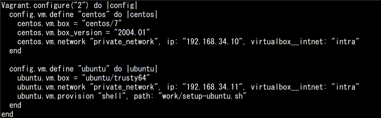
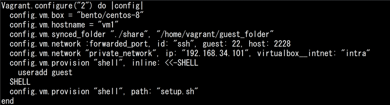

# VMのデプロイとプロビジョニング(主題353) 

## クラウド管理ツール

| 問題 | 回答 | 復習１ | 復習２ | 復習３ |
| ---- | ---- | :----: | :----: | :----: |
| AWSクラウドサービス（EC2、S3、IAMなど）と高い互換性を持つオープンソースのクラウド管理ソフトウェアは？（略語で） | Eucalyptus | <span style="color: red; ">×</span> | <span style="color: red; ">×</span> | ○ |
| Xen、KVM、VMwareなど主要な仮想化ソフトウェアに対応した、仮想データセンタ管理向けの軽量なクラウドソフトウェアは？| OpenNebula | <span style="color: red; ">×</span> | <span style="color: red; ">×</span> | ○ |
| XenServer、KVM、VMware vSphereなど複数のハイパーバイザに対応しており、マネジメントサーバと呼ばれる管理サーバと、ポッド、ゾーンなど階層構造で管理されるリソースで構成されるクラウド管理プラットフォームは？ | CloudStack | ○ | ○ | ○ |
| NASAのコンピューティングサービスとRackspace社のストレージサービスを組み合わせて共同開発されたクラウド基盤ソフトウェアは？ | OpenStack | ○ | ○ | ○ |
| OpenStackのコンポーネントについて、それぞれの説明に適したものを答えよ <br>・VM（仮想マシン）の管理 <br>・ブロックストレージ（ボリューム）管理 <br>・仮想ネットワーク管理 | Nova <br> Cinder <br> Neutron | ○ <br> ○ <br> ○ | ○ <br> ○ <br> ○ | ○ <br> ○ <br> ○ |
| OpenStackのコンポーネントについて、それぞれの説明に適したものを答えよ <br>・統合認証基盤 <br>・オブジェクトストレージ管理 <br>・WebGUI管理 <br>・仮想マシンイメージ管理 | Keystone <br> Swift <br> Horizon <br> Glance | ○ <br> <span style="color: red; ">×</span> <br> ○ <br> <span style="color: red; ">×</span> | ○ <br> ○ <br> ○ <br> ○ <br> | ○ <br> ○ <br> ○ <br> ○ |

### メモ

**クラウド管理ソフトウェア**
- **AWS互換** のオープンソースのクラウド管理ソフトウェア： Eucalyptus (*Elastic Utility Computing Architecture for Linking Your Programs To Useful Systems*)
- Xen、KVM、VMwareなど **主要な仮想化ソフトウェアに対応** した軽量なクラウドソフトウェア： OpenNebula

[戻る](../README.md#vmのデプロイとプロビジョニング主題353)


## Packer

| 問題 | 回答 | 復習１ | 復習２ | 復習３ |
| ---- | ---- | :----: | :----: | :----: |
| HashiCorp社がオープンソースソフトウェアとして提供する、DockerやLXC（LXD）、VirtualBox、AWSやAzureなど主要な仮想化・クラウドプラットフォーム向けのイメージ作成を支援するツールは？ | Packer | ○ | ○ | ○ |
| Packerにおいて、テンプレートファイルに基づいて各仮想化プラットフォーム向けのシステムイメージを作成する役割を持つコンポーネントは？（英語で） | Builders | <span style="color: red; ">×</span> | ○ | ○ |
| Packerにおいて、シェルやAnsibleなどを利用して、ソフトウェアのインストールや設定を行うコンポーネントは？（英語で） | Provisioners | <span style="color: red; ">×</span> | ○ | ○ |
| Packerにおいて、生成物（アーティファクト）に対して、システムイメージの圧縮やプロバイダへのアップロード後処理を行うコンポーネントは？ | Post-processors | <span style="color: red; ">×</span> | ○ | ○ |
| Packerにおいて、テンプレートを基にシステムイメージを作成したりプラグインの管理などができるコマンドは？ | `packer` | ○ | ○ | ○ |
| packerコマンドにおいて、テンプレートを基にシステムイメージを作成するサブコマンドは？ | `build` | <span style="color: red; ">×</span> | <span style="color: red; ">×</span> | ○ |
| packerコマンドにおいて、プラグインのインストールや削除、インストール済みプラグインの一覧表示などプラグインの管理ができるサブコマンドは？ | `plugins` | <span style="color: red; ">×</span> | ○ | ○ |
| packerコマンドにおいて、テンプレートファイルの構文をチェックし、エラーを検出するサブコマンドは？ | `validate` | <span style="color: red; ">×</span> | <span style="color: red; ">×</span> | ○ |
| packerコマンドにおいて、次のようにテンプレートファイルの内容を表示するサブコマンドは？ <br> | `inspect` | <span style="color: red; ">×</span> | <span style="color: red; ">×</span> | ○ |
| 以下はHCL2形式のPackerテンプレートである。空欄に当てはまるものをすべて答えよ <br> | (1) `build` <br> (2) `provisioner` <br> (3) `post-processor` | ○ <br> <span style="color: red; ">×</span> <br> <span style="color: red; ">×</span> | <span style="color: red; ">×</span> <br> ○ <br> ○ | ○ <br> ○ <br> ○ |
| 以下はHCL2形式のPackerテンプレートである。プロビジョナとして実行されるスクリプト名を答えよ <br> | `script.sh` | ○ | ○ | ○ |
| 以下はJSON形式のPackerテンプレートである。空欄に当てはまるものをすべて答えよ <br> | (1) `builders` <br> (2) `provisioners` <br> (3) `variables` <br> (4) `post-processors` | <span style="color: red; ">×</span> <br> <span style="color: red; ">×</span> <br> ○ <br> <span style="color: red; ">×</span> | ○ <br> ○ <br> ○ <br> ○ | ○ <br> ○ <br> ○ <br> ○ |
| 以下はJSON形式のPackerテンプレートである。このうち、ビルドに必須のセクションはどれか <br> | `builders` | ○ | ○ | ○ |
| 以下はJSON形式のPackerテンプレートである。システムイメージを構築する際のベースとなるイメージはどれか（イメージ名のみ回答） <br> | ubuntu | ○ | ○ | ○ |
| 以下はJSON形式のPackerテンプレートである。以下についてそれぞれ答えよ。 <br>・Builders（ビルダー）となるソフトウェア <br>・生成後のシステムイメージの名前 <br> | LXD <br> ubuntu | ○ <br> ○ | ○ <br> ○ | ○ <br> ○ |

### メモ

**Packerのコンポーネント**
- テンプレートファイルに基づいて **システムイメージを作成する** コンポーネント： Builders
- シェルやAnsibleなどを利用して **ソフトウェアのインストールや設定を行う** コンポーネント： Provisioners
- **アーティファクトに対して** システムイメージの圧縮やプロバイダへのアップロード **後処理を行う** コンポーネント： Post-processors
<br> ※いずれも名前が複数形 (*-s*) である点がポイント

**テンプレートファイル**
- HCL2形式のテンプレート： `build { provisioner { ... } post-prosessor { ... } }`
- JSON形式のテンプレート： `builders: [ ... ], provisioners: [ ... ], variables: [ ... ], post-prosessors [ ... ] }`
<br> ※HCL2形式は **`build`** (`builder` ではない) の中に **`provisioner`** と **`post-processor`** を含む、かつ項目名が単数形
<br> ※JSON形式は **`builders`** と **`provisioners`** と **`post-processors`** が並列、かつ項目名が複数形

[戻る](../README.md#vmのデプロイとプロビジョニング主題353)


## cloud-init

| 問題 | 回答 | 復習１ | 復習２ | 復習３ |
| ---- | ---- | :----: | :----: | :----: |
| ユーザアカウントの作成、ネットワーク設定、SSH鍵登録など、OSインストール後の初期設定を自動化するツールは？ | cloud-init | ○ | ○ | ○ |
| cloud-initにおいて、ネットワーク接続前のフェーズで、データソースの検出やローカルに適用可能な設定を行うsystemdのサービスは？（拡張子 .service を除いた基本名（ベース名）のみ回答） | cloud-init-local | ○ | ○ | ○ |
| cloud-initにおいて、ファイルシステムの設定などシステムの初期設定を行うsystemdのサービスは？（拡張子 .service を除いた基本名（ベース名）のみ回答） | cloud-init | ○ | <span style="color: red; ">×</span> | ○ |
| cloud-initにおいて、ネットワークやロケール、タイムゾーン等の設定を行うsystemdのサービスは？（拡張子 .service を除いた基本名（ベース名）のみ回答） | cloud-config | <span style="color: red; ">×</span> | <span style="color: red; ">×</span> | ○ |
| cloud-initにおいて、ユーザスクリプトの実行やカスタム設定の適用、サービス起動などを行うsystemdのサービスは？（拡張子 .service を除いた基本名（ベース名）のみ回答） | cloud-final | <span style="color: red; ">×</span> | <span style="color: red; ">×</span> | ○ |
| cloud-initにおいて、ローカル環境やOpenStackなどで利用できる、仮想CD-ROMや仮想ディスクをデータソースとして指定するものは？（英単語2語で） | config drive | <span style="color: red; ">×</span> | <span style="color: red; ">×</span> | ○ |
| cloud-initにおいて、クラウドプロバイダが提供する固有の情報でインスタンスIDやホスト名、ネットワーク設定などのデータをなんというか（英語で回答）| meta-data | <span style="color: red; ">×</span> | <span style="color: red; ">×</span> | ○ |
| cloud-initにおいて、インスタンスの初期設定をカスタマイズできるYAMLやシェルスクリプトの形式のデータをなんというか（英語で回答） | user-data | <span style="color: red; ">×</span> | <span style="color: red; ">×</span> | ○ |
| cloud-initの設定ファイルが配置されるディレクトリは？（フルパス） | /etc/cloud/ | ○ | ○ | ○ |
| cloud-initにおいて、現在起動しているインスタンスを基にシステムイメージを作成する時、作成したユーザデータを保存するディレクトリは？（フルパス）| /etc/cloud/cloud.cfg.d/ | <span style="color: red; ">×</span> | <span style="color: red; ">×</span> | ○ |
| cloud-initにおいて、インスタンスの起動時に収集したメタデータや実行したユーザデータが保存されるディレクトリは？（フルパス） | /var/lib/cloud/ | <span style="color: red; ">×</span> | ○ | ○ |
| cloud-initにおいて、デバッグ情報が含まれた詳細なログファイル名は？（フルパス） | /var/log/cloud-init.log | <span style="color: red; ">×</span> | <span style="color: red; ">×</span> | ○ |
| cloud-initにおいて、実行されたコマンドの出力が含まれるログファイル名は？（フルパス） | /var/log/cloud-init-output.log | <span style="color: red; ">×</span> | <span style="color: red; ">×</span> | ○ |
| cloud-initにおいて、「/var/lib/cloud」配下のファイルを削除するコマンドは？ | ```cloud-init clean``` | ○ | <span style="color: red; ">×</span> | ○ |
| cloud-initにおいて、YAML形式のユーザデータ記述時に必ず1行目に記載する必要がある記述を答えよ| `#cloud-config` | <span style="color: red; ">×</span> | ○ | ○ |
| cloud-initのユーザデータにおいて、外部ファイルをインクルードする際に1行目に記載する必要がある記述を答えよ | `#include` | <span style="color: red; ">×</span> | ○ | ○ |
| 以下はcloud-initのYAML形式のユーザデータの一部である。「authorized_keys」が保存されるディレクトリは？（フルパス）<br>  | /home/guest/.ssh/ | ○ | ○ | ○ |
| 以下はcloud-initのYAML形式のユーザデータの一部である。システムに追加でインストールされるパッケージは？ <br>  | httpd | ○ | ○ | ○ |
| 以下はcloud-initのYAML形式のユーザデータの一部である。「/mnt2」にマウントされるデバイスのファイルシステム名は？ <br>  | ext4 | ○ | ○ | ○ |
| 以下はcloud-initのYAML形式のユーザデータの一部である。作されるパーティションの数を答えよ <br> | 2 | ○ | ○ | ○ |

### メモ

**cloud-initのsystemdサービス**
- **ネットワーク接続前のフェーズ** で、データソースの検出やローカルに適用可能な設定を行うサービス： cloud-init-local
- ファイルシステムの設定など **システムの初期設定** を行うサービス： cloud-init
- ネットワークやロケール、タイムゾーン等の **（初期設定以降の）設定** を行うサービス： cloud-config
- **ユーザスクリプト実行、カスタム設定適用、サービス起動** 等を行うサービス： cloud-final

**設定ファイル・ディレクトリ**
- cloud-initの設定ファイルが配置されているディレクトリ： /etc/cloud/
- 現在起動しているインスタンスを元にシステムイメージを作成するとき、作成したいユーザデータを保存するディレクトリ： /etc/cloud/cloud.cfg.d/

**起動中インスタンスのメタデータ・ユーザデータ保存先**
- インスタンス起動時に収集したメタデータ・実行済みユーザデータを保存するディレクトリ： /var/lib/cloud

**ログファイル**
- デバッグ情報を含むログファイル： /var/log/cloud-init.log
- 実行したコマンドの出力を含むログファイル： /var/log/cloud-init-output.log
<br>※ /**var/log** 配下に関連ログが配置される点に注意


[戻る](../README.md#vmのデプロイとプロビジョニング主題353)


## Vagrant

| 問題 | 回答 | 復習１ | 復習２ | 復習３ |
| ---- | ---- | :----: | :----: | :----: |
| 設定ファイルに仮想マシンの構成情報を記述することで仮想マシンのプロビジョニングを自動化する仮想環境の作成・管理を支援するツールは？| Vagrant | ○ | ○ | ○ |
| Vagrantのデフォルトのプロバイダは？ | VirtualBox | <span style="color: red; ">×</span> | ○ | ○ |
| Vagrantにおいて、仮想マシンのプロビジョニングを行う基となるパッケージをなんというか | box | ○ | ○ | ○ |
| vagrantコマンドにおいて、Vagrantの設定ファイル「Vagrantfile」を作成するサブコマンドは？ | `init` | ○ | ○ | ○ |
| vagrantコマンドにおいて、Vagrantfileに基づいて仮想マシンを作成するサブコマンドは？  | `up` | <span style="color: red; ">×</span> | <span style="color: red; ">×</span> | <span style="color: red; ">×</span> |
| vagrantコマンドにおいて、仮想マシンをシャットダウンするサブコマンドは？ | `halt` | ○ | <span style="color: red; ">×</span> | ○ |
| vagrantコマンドにおいて、仮想マシンを停止し、関連リソースを削除するサブコマンドは？ | `destroy` | <span style="color: red; ">×</span> | ○ | ○ |
| vagrantコマンドにおいて、稼働中の仮想マシンの状態を保存して、一時停止するサブコマンドは？ | `suspend` | ○ | <span style="color: red; ">×</span> | <span style="color: red; ">×</span> |
| vagrantコマンドにおいて、サスペンド（一時停止）中の仮想マシンの状態を復元して再開するサブコマンドは？ | `resume` | ○ | ○ | <span style="color: red; ">×</span> |
| vagrantコマンドにおいて、稼働中の仮想マシンにSSH接続するサブコマンドは？ | `ssh` | ○ | ○ | ○ |
| vagrantコマンドにおいて、仮想マシンの状態を表示するサブコマンドは？ | `status` | ○ | ○ | ○ |
| vagrantコマンドにおいて、仮想マシンを作成するためのイメージ（box）を管理するサブコマンドは？ | `box` | ○ | ○ | ○ |
| vagrantコマンドにおいて、仮想マシンを再利用可能なboxとしてパッケージ化するサブコマンドは？ | `package` | ○ | ○ | ○ |
| Vagrant Cloud（旧Atlas）で提供されているbox「centos/8」を取得するコマンドラインを答えよ | ```vagrant box add centos/8``` | <span style="color: red; ">×</span> | <span style="color: red; ">×</span> | ○ |
| 次のVagrantfileに定義されている仮想マシン名は？（アルファベット順に回答）<br>  | centos <br> ubuntu | ○ <br> ○ | ○ <br> ○ | ○ <br> ○ |
| 次のVagrantfileを参照し、それぞれについてVagrantfile内の記述を用いて答えよ <br>・仮想マシンのホスト名 <br>・仮想マシンと共有しているホストのディレクトリ名 <br>  | vm1 <br> ./share | ○ <br> <span style="color: red; ">×</span> | ○ <br> ○ | ○ <br> ○ |

### メモ

**起動・停止関連**
- vagrantコマンドで **Vagrantfile作成** のサブコマンド： `init`
- vagrantコマンドで Vagrantfileに基づいて **仮想マシン作成** のサブコマンド： `up`
- vagrantコマンドで **仮想マシンシャットダウン** のサブコマンド： `halt`
- vagrantコマンドで **仮想マシンの状態を保存・一時停止** のサブコマンド： `suspend` <br> ※ `save` ではなく **`suspend`** である点、停止ではなく **一時停止** のために状態保存である点に注意<br>　(xl (Xen), virsh (Libvirt) とは異なる)
- vagrantコマンドで **（一時停止中）仮想マシンの状態を復元・再開** のサブコマンド `resume` <br> ※ `restore` ではなく **`resume`** である点、起動ではなく **再開** のための復元であるに注意<br>　(xl (Xen), virsh (Libvirt) とは異なる)

[戻る](../README.md#vmのデプロイとプロビジョニング主題353)
