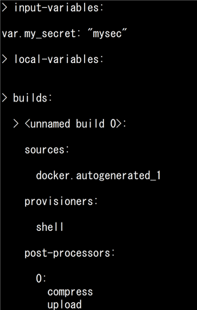
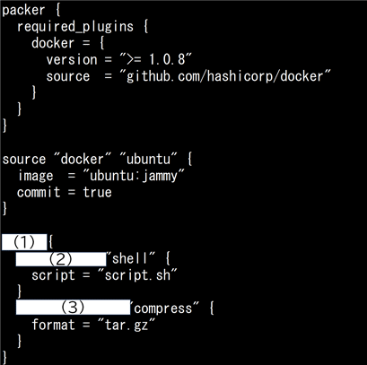
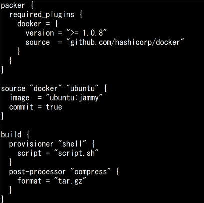
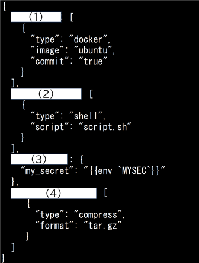
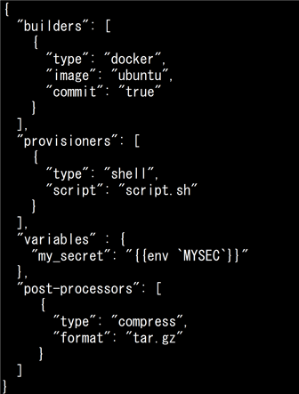
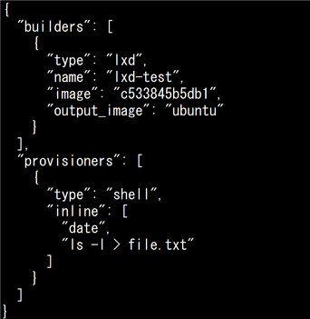
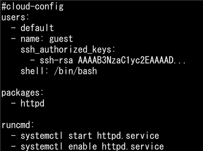
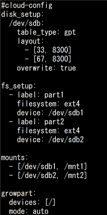

# VMのデプロイとプロビジョニング(主題353) 

## クラウド管理ツール

| 問題 | 回答 |
| ---- | ---- |
| AWSクラウドサービス（EC2、S3、IAMなど）と高い互換性を持つオープンソースのクラウド管理ソフトウェアは？（略語で） | Eucalyptus |
| Xen、KVM、VMwareなど主要な仮想化ソフトウェアに対応した、仮想データセンタ管理向けの軽量なクラウドソフトウェアは？| OpenNebula |
| XenServer、KVM、VMware vSphereなど複数のハイパーバイザに対応しており、マネジメントサーバと呼ばれる管理サーバと、ポッド、ゾーンなど階層構造で管理されるリソースで構成されるクラウド管理プラットフォームは？ | CloudStack |
| NASAのコンピューティングサービスとRackspace社のストレージサービスを組み合わせて共同開発されたクラウド基盤ソフトウェアは？ | OpenStack |
| OpenStackのコンポーネントについて、それぞれの説明に適したものを答えよ <br>・VM（仮想マシン）の管理 <br>・ブロックストレージ（ボリューム）管理 <br>・仮想ネットワーク管理 | Nova <br> Cinder <br> Neutron |
| OpenStackのコンポーネントについて、それぞれの説明に適したものを答えよ <br>・統合認証基盤 <br>・オブジェクトストレージ管理 <br>・WebGUI管理 <br>・仮想マシンイメージ管理 | Keystone <br> Swift <br> Horizon <br> Glance |

[戻る](../README.md#vmのデプロイとプロビジョニング主題353)


## Packer

| 問題 | 回答 |
| ---- | ---- |
| HashiCorp社がオープンソースソフトウェアとして提供する、DockerやLXC（LXD）、VirtualBox、AWSやAzureなど主要な仮想化・クラウドプラットフォーム向けのイメージ作成を支援するツールは？ | Packer |
| Packerにおいて、生成物（アーティファクト）に対して、システムイメージの圧縮やプロバイダへのアップロード後処理を行うコンポーネントは？ | Post-processors |
| Packerにおいて、テンプレートファイルに基づいて各仮想化プラットフォーム向けのシステムイメージを作成する役割を持つコンポーネントは？（英語で） | Builders |
| Packerにおいて、シェルやAnsibleなどを利用して、ソフトウェアのインストールや設定を行うコンポーネントは？（英語で） | Provisioners |
| Packerにおいて、テンプレートを基にシステムイメージを作成したりプラグインの管理などができるコマンドは？ | `packer` |
| packerコマンドにおいて、テンプレートを基にシステムイメージを作成するサブコマンドは？ | `build` |
| packerコマンドにおいて、プラグインのインストールや削除、インストール済みプラグインの一覧表示などプラグインの管理ができるサブコマンドは？ | `builders` |
| packerコマンドにおいて、テンプレートファイルの構文をチェックし、エラーを検出するサブコマンドは？ | `validate` |
| packerコマンドにおいて、次のようにテンプレートファイルの内容を表示するサブコマンドは？ <br> | `inspect` |
| 以下はHCL2形式のPackerテンプレートである。空欄に当てはまるものをすべて答えよ <br> | (1) `build` <br> (2) `provisioner` <br> (3) `post-processor` |
| 以下はHCL2形式のPackerテンプレートである。プロビジョナとして実行されるスクリプト名を答えよ <br> | `script.sh` |
| 以下はJSON形式のPackerテンプレートである。空欄に当てはまるものをすべて答えよ <br> | (1) `builders` <br> (2) `provisioners` <br> (3) `variables` <br> `post-processors` |
| 以下はJSON形式のPackerテンプレートである。このうち、ビルドに必須のセクションはどれか <br> | `builders`
| 以下はJSON形式のPackerテンプレートである。システムイメージを構築する際のベースとなるイメージはどれか（イメージ名のみ回答） <br> | ubuntu |
| 以下はJSON形式のPackerテンプレートである。以下についてそれぞれ答えよ。 <br>・Builders（ビルダー）となるソフトウェア <br>・生成後のシステムイメージの名前 <br> | LXD <br> ubuntu |

[戻る](../README.md#vmのデプロイとプロビジョニング主題353)


## cloud-init

| 問題 | 回答 |
| ---- | ---- |
| ユーザアカウントの作成、ネットワーク設定、SSH鍵登録など、OSインストール後の初期設定を自動化するツールは？ | cloud-init |
| cloud-initにおいて、ファイルシステムの設定などシステムの初期設定を行うsystemdのサービスは？（拡張子 .service を除いた基本名（ベース名）のみ回答） | cloud-init |
| cloud-initにおいて、ネットワーク接続前のフェーズで、データソースの検出やローカルに適用可能な設定を行うsystemdのサービスは？（拡張子 .service を除いた基本名（ベース名）のみ回答） | cloud-init-local |
| cloud-initにおいて、ネットワークやロケール、タイムゾーン等の設定を行うsystemdのサービスは？（拡張子 .service を除いた基本名（ベース名）のみ回答） | cloud-config |
| cloud-initにおいて、ユーザスクリプトの実行やカスタム設定の適用、サービス起動などを行うsystemdのサービスは？（拡張子 .service を除いた基本名（ベース名）のみ回答） | cloud-final |
| cloud-initにおいて、「/var/lib/cloud」配下のファイルを削除するコマンドは？ | ```cloud-init clean``` |
| cloud-initにおいて、インスタンスの初期設定をカスタマイズできるYAMLやシェルスクリプトの形式のデータをなんというか（英語で回答） | user-data |
| cloud-initにおいて、クラウドプロバイダが提供する固有の情報でインスタンスIDやホスト名、ネットワーク設定などのデータをなんというか（英語で回答）| meta-data |
| cloud-initにおいて、ローカル環境やOpenStackなどで利用できる、仮想CD-ROMや仮想ディスクをデータソースとして指定するものは？（英単語2語で） | config drive |
| cloud-initにおいて、インスタンスの起動時に収集したメタデータや実行したユーザデータが保存されるディレクトリは？（フルパス） | /var/lib/cloud/ |
| cloud-initにおいて、実行されたコマンドの出力が含まれるログファイル名は？（フルパス） | /var/log/cloud-init-output.log |
| cloud-initにおいて、デバッグ情報が含まれた詳細なログファイル名は？（フルパス） | /var/log/cloud-init.log |
| cloud-initの設定ファイルが配置されるディレクトリは？（フルパス） | /etc/cloud/ |
| cloud-initにおいて、現在起動しているインスタンスを基にシステムイメージを作成する時、作成したユーザデータを保存するディレクトリは？（フルパス）| /etc/cloud/cloud.cfg.d/ |
| cloud-initにおいて、YAML形式のユーザデータ記述時に必ず1行目に記載する必要がある記述を答えよ| `#cloud-config` |
| cloud-initのユーザデータにおいて、外部ファイルをインクルードする際に1行目に記載する必要がある記述を答えよ | `#include` |
| 以下はcloud-initのYAML形式のユーザデータの一部である。「authorized_keys」が保存されるディレクトリは？（フルパス）<br>  | /home/guest/.ssh/ |
| 以下はcloud-initのYAML形式のユーザデータの一部である。システムに追加でインストールされるパッケージは？ <br>  | httpd |
| 以下はcloud-initのYAML形式のユーザデータの一部である。「/mnt2」にマウントされるデバイスのファイルシステム名は？ <br>  | ext4 |
| 以下はcloud-initのYAML形式のユーザデータの一部である。作成されるパーティションの数を答えよ <br> | 2 |

[戻る](../README.md#vmのデプロイとプロビジョニング主題353)

